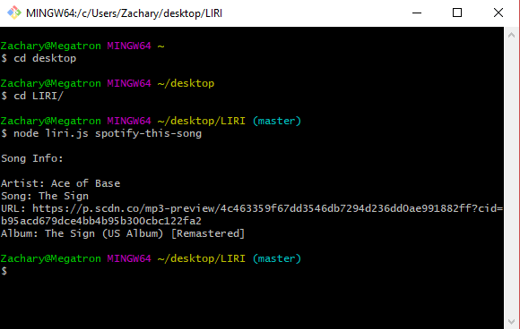
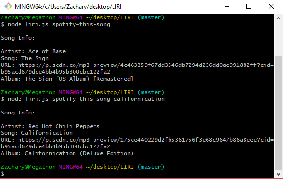
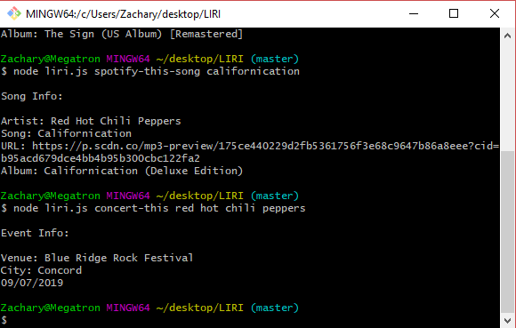
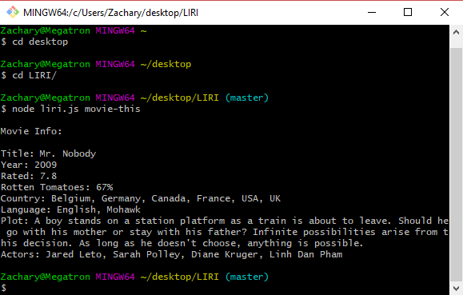
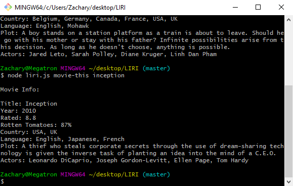
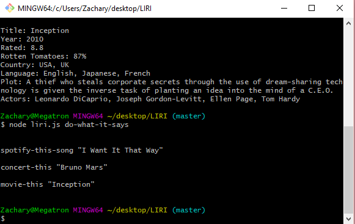

# LIRI-Unit
LIRI is a Language Interpretation and Recognition Interface.

*It takes in an action request and an optional argument,
such as a movie-title, both using node's process.argv.

*Action requests include retrieving song information from Spotify API, movie information from OMDB and concert info from the Bands in Town API. Below are LIRI's action requests:

```
// Search for song <song name is optional>:
node liri.js spotify-this-song <song name>


```

```
// Search for concert:
node liri.js concert-this <band name>

```

```
// Search for movie <movie name is optional>:
node liri.js movie-this <movie name>


```

*LIRI also calls out to a random text file that can include any action or argument. *LIRI'S action request for text file content is:

```
// Read from text file:
node liri.js do-what-it-says

```

*LIRI uses npm modules, moment, and dotenv for real-time data and privacy.